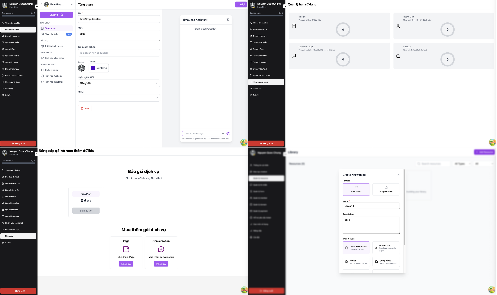

# AI Agent - Nền Tảng Chatbot Thông Minh

## Mô Tả:

AI Agent là một nền tảng SaaS toàn diện được thiết kế để tạo, quản lý và triển khai các chatbot AI thông minh với khả năng tương tác tiên tiến. Nền tảng cung cấp trải nghiệm người dùng tuyệt vời cho các doanh nghiệp muốn tích hợp AI vào hệ thống customer service và automation.

AI Agent hoạt động mượt mà trên tất cả các trình duyệt web hiện đại và được tối ưu hóa cho cả thiết bị di động và máy tính để bàn.

**Các Tính Năng Chính:**

- Tạo và quản lý chatbot AI với khả năng học từ tài liệu training tùy chỉnh
- Hệ thống conversation real-time với WebSocket để tương tác trực tiếp
- Multi-workspace hỗ trợ quản lý nhiều dự án và team với phân quyền chi tiết
- Tích hợp embedding widget dễ dàng vào website của khách hàng
- Dashboard analytics chi tiết để theo dõi hiệu suất và usage
- Hệ thống subscription linh hoạt với quản lý billing tự động
- API tokens để tích hợp với third-party services

## Công Nghệ Sử Dụng:

### Frontend:
- [Next.js 14:](https://nextjs.org/) Framework React hiện đại với App Router và TypeScript
- [Tailwind CSS:](https://tailwindcss.com/) Framework CSS utility-first cho UI responsive
- [Zustand:](https://zustand-demo.pmnd.rs/) Thư viện quản lý state nhẹ và hiệu quả
- [i18next:](https://www.i18next.com/) Hệ thống đa ngôn ngữ (tiếng Việt & tiếng Anh)

### Backend:
- [NestJS:](https://nestjs.com/) Framework Node.js enterprise-grade với TypeScript
- [TypeORM:](https://typeorm.io/) ORM mạnh mẽ cho PostgreSQL với type safety
- [Redis:](https://redis.io/) In-memory database cho caching và session management
- [JWT:](https://jwt.io/) Authentication với Access & Refresh tokens

## Screenshots

### Dashboard Quản Lý Chatbot

Giao diện dashboard hiện đại cho phép quản lý chatbot, training data, conversations và analytics một cách trực quan và dễ dàng.

### Landing Page & Pricing

Trang chủ với thiết kế chuyên nghiệp, giới thiệu tính năng và bảng giá linh hoạt cho các gói dịch vụ khác nhau.